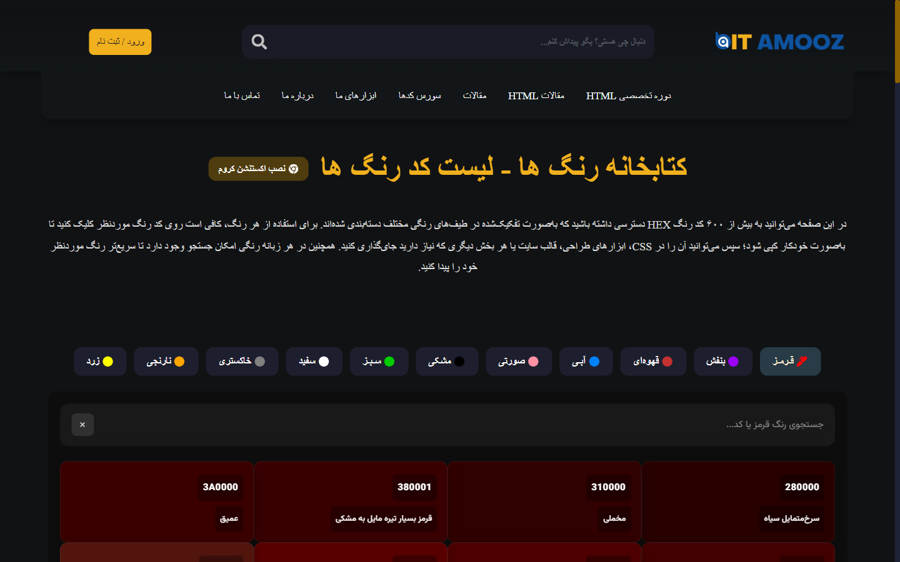

# 🎨 کتابخانه رنگ

آرشیو آفلاین صفحه‌ی «کتابخانه رنگ» با بیش از **۶۰۰ کد رنگ HEX** دسته‌بندی‌شده در طیف‌های رنگی مختلف، به‌همراه جستجو، کپی خودکار و تبدیل به RGB و CMYK.


## 🖼 پیش‌نمایش



## 📥 نسخه آنلاین

نسخه اصلی و به‌روز پروژه روی وب‌سایت **بیت‌اموزز** در دسترس است:

**[مشاهده نسخه آنلاین کتابخانه رنگ](https://bitamooz.com/tools/colors/)**

[](https://bitamooz.com/tools/colors/)

## ✨ امکانات

- **۶۰۰+ کد رنگ HEX** تفکیک‌شده بر اساس ۱۱ طیف رنگی (قرمز، نارنجی، زرد، سبز، آبی، بنفش، صورتی، قهوه‌ای، مشکی، سفید، خاکستری)
- **کپی خودکار**: با یک کلیک روی هر کد رنگ، کد در کلیپ‌بورد کپی می‌شود
- **جستجو در هر طیف** برای پیدا کردن سریع رنگ دلخواه
- **تبدیل رنگ** بین HEX، RGB و CMYK
- **قابل استفاده آفلاین** بدون نیاز به اینترنت یا سرور

## 🛠 تکنولوژی‌ها

| بخش | ابزار |
|---|---|
| ساختار صفحه | HTML |
| استایل | CSS |
| اسکریپت | jQuery |
| ابزار آینه‌برداری | HTTrack Website Copier |
| وب‌سرور محلی | XAMPP / PHP |

## 📁 ساختار پروژه

```text
ColorLibrary/
├── index.html                          # فهرست پروژه‌های آفلاین‌شده (HTTrack)
├── ColorLibrary.whtt                   # فایل پروژه HTTrack
├── backblue.gif / fade.gif             # تصاویر قالب HTTrack
├── CONTRIBUTORS.md                     # مشخصات توسعه‌دهنده اصلی
└── ColorLibrary/
    ├── bitamooz.com/
    │   └── tools/colors/index.html     # ★ صفحه اصلی کتابخانه رنگ
    ├── wp-content/themes/...           # فایل استایل قالب
    ├── wp-includes/js/...              # فایل‌های جاوااسکریپت
    ├── cdn.yektanet.com/               # منابع بیرونی آینه‌شده
    ├── i.ytimg.com/                    # منابع بیرونی آینه‌شده
    ├── localhost/                      # منابع محلی
    └── hts-cache/ , hts-log.txt        # کش و لاگ آینه‌برداری
```

## 🚀 اجرا

۱. پوشه پروژه را داخل `htdocs` قرار دهید (مثلاً `C:\xampp\htdocs\ColorLibrary`).
۲. سرویس **Apache** را در XAMPP روشن کنید.
۳. فایل زیر را در مرورگر باز کنید:

```text
http://localhost/ColorLibrary/ColorLibrary/bitamooz.com/tools/colors/index.html
```

> بدون XAMPP هم می‌توانید فایل `index.html` را مستقیماً در مرورگر باز کنید؛ چون پروژه کاملاً آفلاین است نیازی به اینترنت ندارد.

## ⚖️ حقوق و مالکیت

> ⚠️ **تمام حقوق این پروژه متعلق به وب‌سایت [bitamooz.com](https://bitamooz.com/) است.**

این مخزن تنها یک آرشیو آفلاین از صفحه‌ی اصلی در `bitamooz.com/tools/colors/` است. هرگونه کپی، ویرایش، بازنشر یا استفاده‌ی تجاری از محتوا، کد و فایل‌های این پروژه بدون اجازه‌ی کتبی صاحبش مجاز نیست. نسخه اصلی و همیشه به‌روز، همین نسخه آنلاین است.

## 🤝 مشارکت

برای گزارش ایراد یا پیشنهاد، لطفاً ابتدا نسخه آنلاین را بررسی کنید و سپس موضوع را همراه با مراحل بازتولید گزارش دهید.

---

ساخته‌شده با ❤️ برای [بیت‌اموزز](https://bitamooz.com/) — تمام حقوق محفوظ است.
